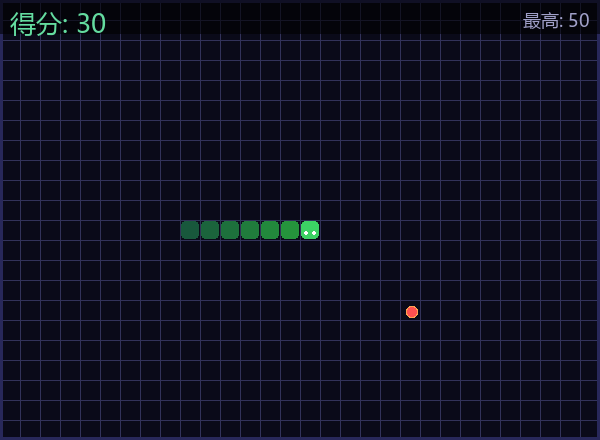

# 贪吃蛇 (Snake Game)

[](https://www.python.org/)
[](https://www.pygame.org/)
[](https://github.com/)

> A classic Snake game built with Python and Pygame, featuring smooth animations, Chinese/English bilingual UI, and a high-score tracking system.

---

## 游戏截图 / Game Screenshot



---

## 功能特性 / Features

- **方向键 / WASD 控制** — Arrow keys or WASD to move the snake
- **难度递增** — Speed increases every 50 points
- **历史最高分** — Persistent high score saved locally
- **中英文双语界面** — Bilingual Chinese/English labels
- **暂停 / 继续** — Press Space to pause and resume
- **渐变蛇身** — Gradient snake body with animated head and eyes
- **脉冲食物** — Pulsing food animation
- **全平台支持** — Windows / macOS / Linux

---

## 环境依赖 / Prerequisites

### 1. Python

| Item | Version | Download |
|------|---------|----------|
| Python (Windows) | ≥ 3.8 | [python.org/downloads](https://www.python.org/downloads/) |
| Python (macOS) | ≥ 3.8 | `brew install python3` |
| Python (Linux) | ≥ 3.8 | `sudo apt install python3 python3-pip` |

> **Windows installer tip:** Check ✅ **Add Python to PATH** during installation.

### 2. Pygame

```bash
# Universal install (all platforms)
pip install pygame

# Verify installation
python -m pygame.ver
```

---

## 安装运行 / Quick Start

### Windows

**Option A — Run with batch file:**
```bash
# Double-click run_snake.bat in the project folder
```

**Option B — Run with Python directly:**
```bash
cd snake
python snake_game.py
```

### macOS / Linux

```bash
cd snake
python3 snake_game.py
```

---

## 操作说明 / Controls

| 按键 / Key | 功能 / Action |
|---|---|
| ↑ ↓ ← → / W A S D | 移动蛇的方向 / Move snake |
| 空格 / Space | 开始游戏 / 暂停 / 继续 / Start / Pause / Resume |
| R | 重新开始 / Restart game |
| ESC | 退出游戏 / Quit game |
| 鼠标左键 / Left Click | 开始 / 暂停 / 继续 / Start / Pause / Resume |

---

## 文件结构 / Project Structure

```
snake/
├── snake_game.py        # 主游戏代码 / Main game code
├── run_snake.bat        # Windows 快速启动脚本 / Windows launch script
├── requirements.txt     # Python 依赖 / Python dependencies
├── LICENSE              # MIT License
├── README.md            # 本文件 / This file
└── screenshots/
    └── snake_gameplay.png  # 游戏截图 / Game screenshot
```

---

## 最高分保存 / High Score Storage

分数保存在本地文件：
- **Windows:** `D:\snake_best.txt`（或游戏目录下 `snake_best.txt`）
- **macOS / Linux:** `~/snake_best.txt`

Score is saved in a local file. If the configured path is inaccessible, the game will run normally without persisting the high score.

---

## 技术细节 / Technical Details

| Item | Detail |
|------|--------|
| 语言 / Language | Python 3 |
| 游戏库 / Game Library | Pygame 2.x |
| 帧率 / Frame Rate | 60 FPS rendering, 8 logic FPS (increases with score) |
| 窗口尺寸 / Window | 600 × 440 px |
| 字体回退 / Font Fallback | 微软雅黑 → 黑体 → 楷体 → 宋体 → System default |

---

## License

MIT License — see [LICENSE](LICENSE) file for details.
